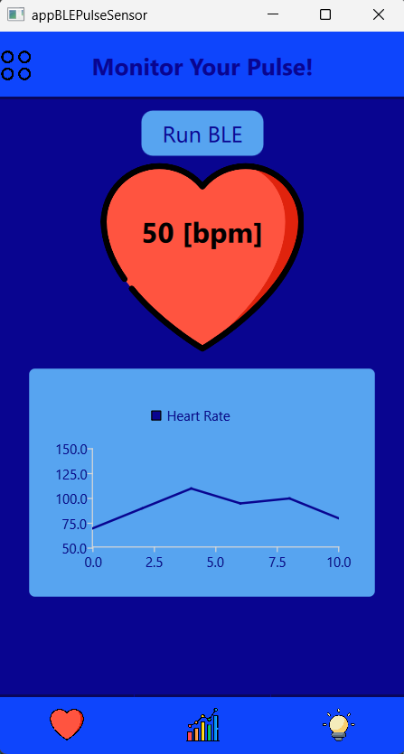
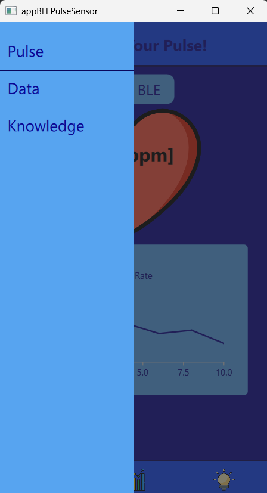
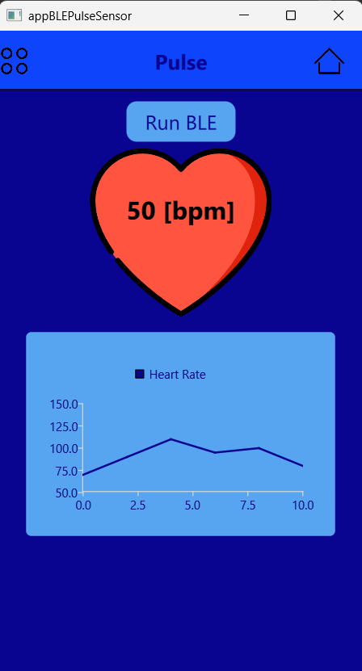
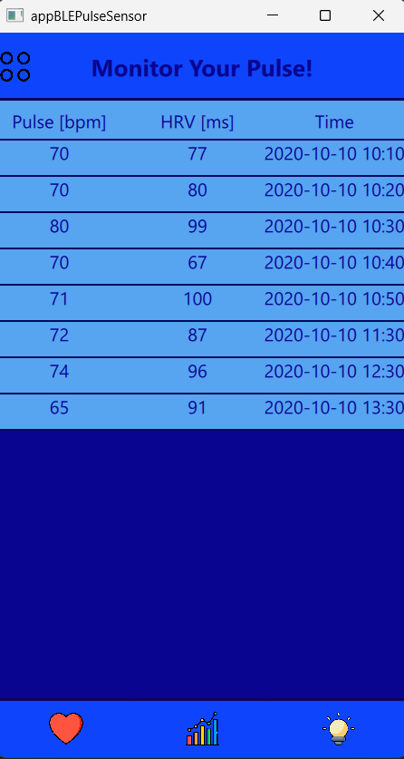
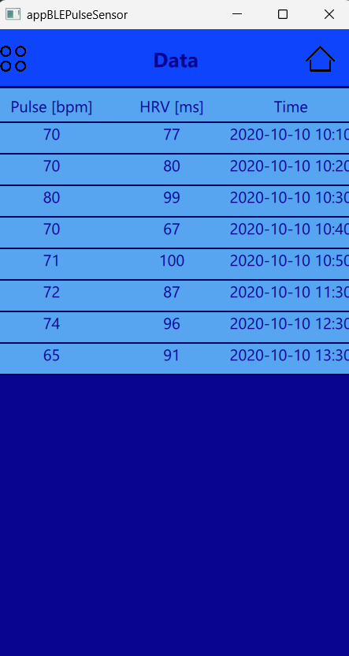

<!---->
# QML project for app with Bluetooth Low Energy & Pulse Sensor connection
## Objective
This project encompasses two key components:
1. **Simple GUI App**: a user-friendly GUI that allows you to monitor your heart rate with extra knowledge about the circulatory system and pulse
2. **Bluetooth Low Energy & Pulse Sensor Integration**: data read from the heart rate sensor is sent to the application via the BLE module.

## Key results
### **Pulse Sensor Tracking Application**
Below is an overview of the main components prepared in the QML.


| App Components | Description | Status |
| ----------- | ----------- | ----------- |
| Charts Module | Visualization of the data on a graph | Done |
| Data Module | Simple list view shows pulse, HRV, and time data. | Done |
| Knowledge Module | Knowledge about the circulatory system and pulse. | In progress |

### **Pulse Sensor and BLE Integration**

Details about the integration will be available soon on the Instructables page.

## Content
- [App examples](./README.md#app-examples)
- [How to run the app?](./README.md#how-to-run-the-app)
  - [Environment](./README.md#environment)
  - [Used technologies](./README.md#used-technologies)
  - [Run the app](./README.md#run-the-app)

## App examples










## How to run the app?
### Environment
- Windows 11

### Used technologies
- Qt
- C++
- CMake 
- QML
- SQLite (as a local database)

### Run the app
Download files from GitHub
```
git clone https://github.com/Susannnnnna/Qt-BLEPulseSensor
```
